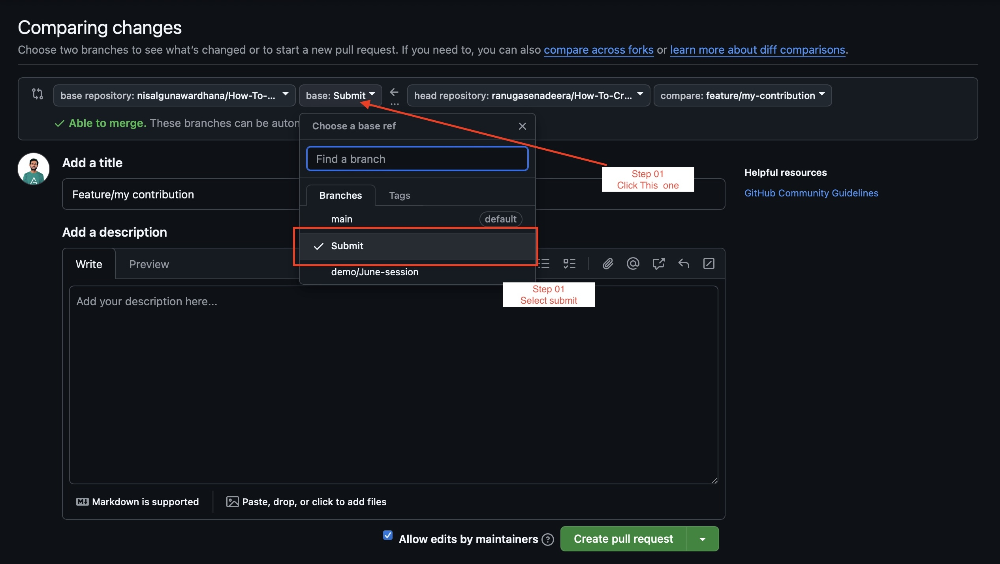
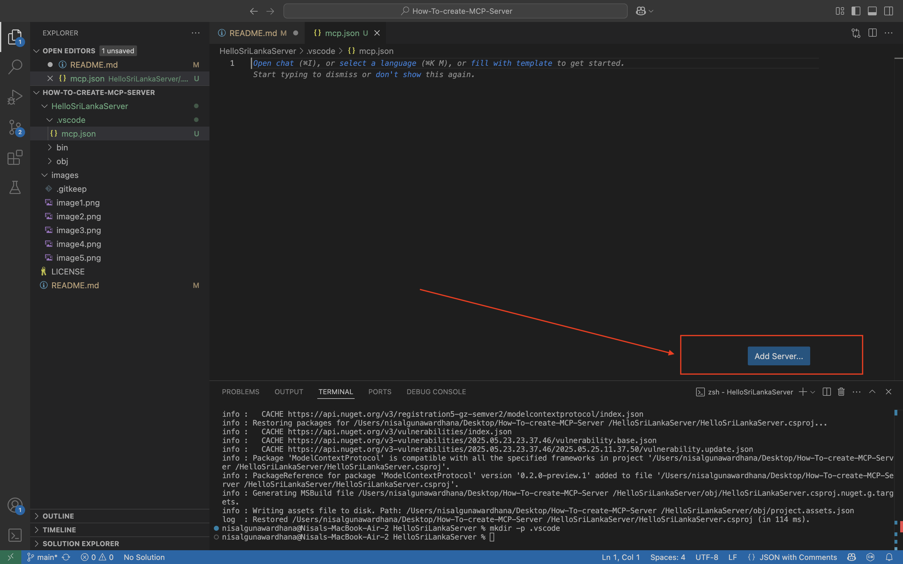
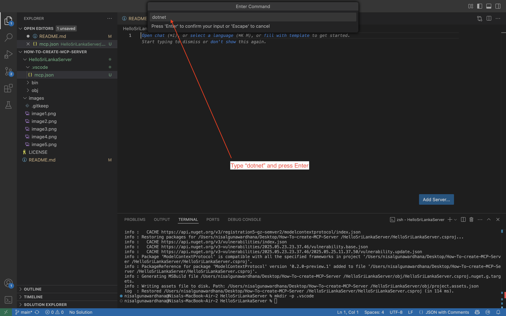
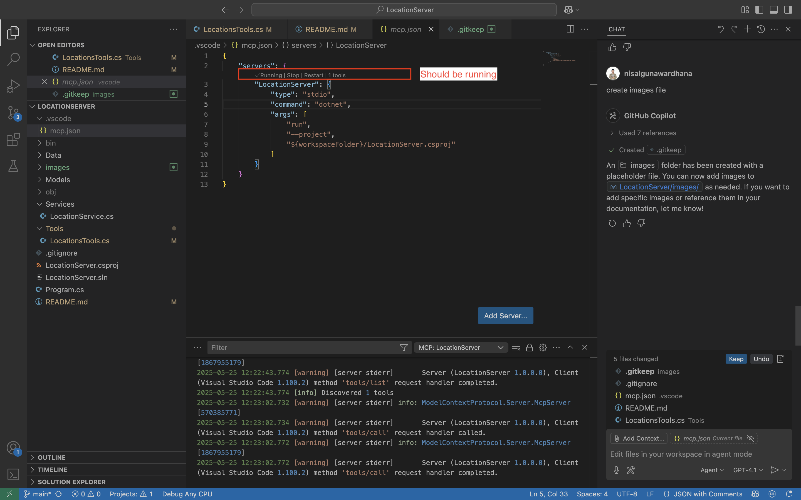

# How to Create MCP Server Using .NET

This guide will help you set up a basic MCP (Model Context Protocol) server in .NET, configure it in VS Code, and interact with it using Copilot Chat.

[](https://github.com/nisalgunawardhana)


## How to Clone This Repo and Start Working

1. **Fork this repository** to your own GitHub account.
2. **Clone your fork** to your local machine:
    ```zsh
    git clone https://github.com/<your-username>/How-To-Create-MCP-Server
    cd How-To-Create-MCP-Server
    ```
    > **Note:** Replace `<your-username>` with your actual GitHub username in the clone URL above.
3. **Create a new branch** for your changes (for example, `feature/my-contribution`):
    ```zsh
    git checkout -b feature/my-contribution
    ```

    > <span style="background-color:#ffdddd; padding:2px 6px; border-radius:4px;">🛑 **Already completed steps 1–3?**</span>  
    > If you've already forked, cloned, and created your branch, you can skip ahead to [🚀 Start Work Now](#-start-work-now) and continue with the rest of the setup!
    
4. **Make your changes** and commit them.
    ```zsh
    git add .
    git commit -m"my-contribution"
    ```
5. **Push your branch** to your fork:
    ```zsh
    git push origin feature/my-contribution
    ```
    Once you've pushed your changes, go to your GitHub repository in your browser. Switch to the `feature/my-contribution` branch


        
6. **Open a Pull Request (PR)** from your branch to the `Submit` branch of this repository (not `main`).

**Step 01**

**Step 02**


> **Note:** Please do **not** open PRs directly to the `main` branch. Always target the `Submit` branch for contributions.
**Follow the steps below to set up and run the MCP server.**

---

## 🚀 Start Work Now

Ready to dive in?  
After cloning and setting up your branch, you can immediately begin making changes or adding features to the MCP server project. Use the provided steps below to guide your development process. If you get stuck, refer to the resources and discussion links at the end of this guide.

---

## 1. Install .NET

Download and install the [.NET SDK](https://dotnet.microsoft.com/download) for your OS.
> **Note:** This guide uses **.NET SDK 8**. Make sure you download the correct version for your operating system.

If you're using **VS Code**, install the [C# Dev Kit extension](https://marketplace.visualstudio.com/items?itemName=ms-dotnettools.csdevkit) for the best development experience.

Verify installation in your terminal:
```zsh
dotnet --version
```

---

## 2. Create a New Project

Open your terminal and run:
```zsh
dotnet new console -o HelloSriLankaServer
cd HelloSriLankaServer
```

---

## 3. Install Required Packages

Install the necessary NuGet packages:

```zsh
dotnet add package ModelContextProtocol --prerelease
dotnet add package Microsoft.Extensions.Hosting --prerelease
```


---
## Project Folder Structure

After creating the project, your folder structure should look like this:

```text
How-To-create-MCP-Server/
├── HelloSriLankaServer/
│   ├── Program.cs
│   ├── HelloSriLankaServer.csproj
│   └── (other project files)
├── images/
│   ├── image1.png
│   └── image2.png
├── README.md
└── LICENSE
```

This structure helps keep your source code, configuration, and documentation organized.

---

## 4. Update `Program.cs`

Clear the contents of `Program.cs` and replace with:

```csharp
using Microsoft.Extensions.DependencyInjection;
using Microsoft.Extensions.Hosting;
using Microsoft.Extensions.Logging;
using Microsoft.Extensions.Logging.Console;
using Microsoft.Extensions.Options;
using ModelContextProtocol.Server;
using System.ComponentModel;

var builder = Host.CreateApplicationBuilder(args);

builder.Logging.AddConsole(options => {
    options.LogToStandardErrorThreshold = LogLevel.Trace;
});

builder.Services.AddMcpServer()
    .WithStdioServerTransport()
    .WithToolsFromAssembly();

Console.WriteLine(builder.Environment.ContentRootPath);
var app = builder.Build();

await app.RunAsync();

[McpServerToolType]
public static class HelloTool
{
    [McpServerTool(Name = "HelloTool"), Description("Say hello to Sri Lanka!")]
    public static void SayHello()
    {
        Console.WriteLine("Hello Sri Lanka!");
        
    }
}
```

---

## 5. Configure MCP in VS Code

Before creating the `.vscode` directory, navigate back to the project root if you're inside the `HelloSriLankaServer` folder:

```zsh
cd ..
```

1. In your project root, create a `.vscode` directory:
    ```zsh
    mkdir -p .vscode
    ```

2. Inside `.vscode`, create a file named `mcp.json` and add your server configuration.

    - Once created, you will see an **Add Server** button. Click it.  
      

    - Choose **"Command (stdio)"** as the server type.  
      

    - Enter `"dotnet"` as the command and press Enter.  
      

    - Enter the server name `"Hello-SriLankaServer"` and press Enter.  
      

    - The `mcp.json` file will be populated automatically. Replace its contents with the following:

      ```json
      {
        "servers": {
          "Hello-SriLankaServer": {
            "type": "stdio",
            "command": "dotnet",
            "args": [
              "run",
              "--project",
              "${workspaceFolder}/HelloSriLankaServer/HelloSriLankaServer.csproj"
            ]
          }
        }
      }
      ```
      ```
      > **Note:** `${workspaceFolder}` will automatically resolve to your project root. If it does not work, replace it with the actual path to your `.csproj` file (right-click the file in VS Code and select "Copy Path").

## 6. Run the MCP Server(test if it's work)

From the `HelloSriLankaServer` directory, start the server:
```zsh
dotnet run
```
> **Note:** Once you've confirmed the server is running successfully, you can stop it (press `Ctrl+C` in the terminal) and proceed to the next step (Step 7).
---

## 7. Add the Tool in Copilot Chat

1. Open Copilot Chat in VS Code.
2. Click the **gear icon** (⚙️) or the **"Add Tool"** button.
3. Select your MCP server (`Hello-Server`) from the list.

**Image Example:**
> **Note:** The example images may display "LocationServer" or a similar name, but it actually refers to your MCP server (`HelloSriLankaServer`).



---

## 8. Send a Message Using Copilot Chat

1. In Copilot Chat, select the `HelloSriLankaServer` tool.
2. Type a message to invoke your tool, for example:
    ```
    Can you Say hello from the tool
    ```
3. You should see a reply from your MCP server in the chat.
    ```
    Hello Sri Lanka !
    
    ```

---

## 9. Get a Reply from the MCP Server

You will receive a response from your MCP server in the Copilot Chat window.

---

## 10. Advanced Demo: Try the MCP Location Server

For a more advanced example, you can explore the [Try-mcp-location-server-demo](https://github.com/nisalgunawardhana/Try-mcp-location-server-demo) repository. This demo showcases how to build and interact with a location-based MCP server using .NET.

---

## Additional Learning Resources

For a deeper understanding of MCP and more hands-on examples, check out the [Introduction to MCP](https://github.com/nisalgunawardhana/introduction-to-mcp) repository. This resource provides tutorials, sample projects, and further guidance on working with MCP in .NET.

---

## 💬 Join the Discussion!

Have questions, ideas, or want to share your experience?  
We welcome you to use [GitHub Discussions](https://github.com/nisalgunawardhana/How-To-create-MCP-Server/discussions) for:

- Asking questions about setup or usage
- Sharing feedback or suggestions
- Requesting new features
- Connecting with other contributors

👉 **Click the "Discussions" tab at the top of this repo to start or join a conversation!**

Let's build and learn together!

---

## Connect with Me

Follow me on social media for more sessions, tech tips, and giveaways:

- [LinkedIn](https://www.linkedin.com/in/nisalgunawardhana/) — Professional updates and networking
- [Twitter (X)](https://x.com/thenisals) — Insights and announcements
- [Instagram](https://www.instagram.com/thenisals) — Behind-the-scenes and daily tips
- [GitHub](https://github.com/nisalgunawardhana) — Repositories and project updates
- [YouTube](https://www.youtube.com/channel/UCNP5-zR4mN6zkiJ9pVCM-1w) — Video tutorials and sessions

Feel free to connect and stay updated!

---

## License

This project is licensed under the [MIT License](LICENSE).

---

**Tip:**  
You can add more tools to your MCP server by extending the `HelloTool` class in `Program.cs`.
